# Task Manager API

A RESTful API built with ASP.NET Core as part of a Udemy course on building RESTful APIs with .NET Framework.

## Overview

This project is a simple Task Manager API that demonstrates RESTful API principles including CRUD operations, proper HTTP methods, and status codes.

## API Workflow Architecture

```mermaid
graph TB
    Client[🌐 Client/Postman] -->|HTTP Request| Controller[🎮 TaskItemsController]
    
    Controller -->|📖 GET /api/taskitems| GetAll[📋 GetAllTask]
    Controller -->|🔍 GET /api/taskitems/id| GetById[📄 GetTaskById]
    Controller -->|➕ POST /api/taskitems| Post[✨ AddTask]
    Controller -->|✏️ PUT /api/taskitems/id| Put[🔄 UpdateTask]
    Controller -->|🗑️ DELETE /api/taskitems/id| Delete[❌ DeleteTask]
    
    GetAll -->|Calls| Repo[📦 TaskRepository]
    GetById -->|Calls| Repo
    Post -->|Calls| Repo
    Put -->|Calls| Repo
    Delete -->|Calls| Repo
    
    Repo -->|LINQ Queries| DbContext[🔌 ApiDbContext]
    DbContext -->|Entity Framework Core| DB[(🗄️ SQL Server LocalDB<br/>TaskManagementDB)]
    
    DB -->|Data| DbContext
    DbContext -->|Returns| Repo
    Repo -->|Success/Failure| Controller
    
    Controller -->|✅ 200 OK| Client
    Controller -->|🎉 201 Created| Client
    Controller -->|⚠️ 400 Bad Request| Client
    Controller -->|❓ 404 Not Found| Client
    
    style Client fill:#4A90E2,stroke:#2E5C8A,stroke-width:3px,color:#fff
    style Controller fill:#F5A623,stroke:#D68910,stroke-width:3px,color:#fff
    style GetAll fill:#7ED321,stroke:#5FA319,stroke-width:2px,color:#fff
    style GetById fill:#7ED321,stroke:#5FA319,stroke-width:2px,color:#fff
    style Post fill:#50E3C2,stroke:#3AB39A,stroke-width:2px,color:#fff
    style Put fill:#BD10E0,stroke:#8B0AA8,stroke-width:2px,color:#fff
    style Delete fill:#FF6B6B,stroke:#CC5555,stroke-width:2px,color:#fff
    style Repo fill:#9013FE,stroke:#6B0FBF,stroke-width:3px,color:#fff
    style DbContext fill:#F8E71C,stroke:#C6B916,stroke-width:3px,color:#333
    style DB fill:#E74C3C,stroke:#C0392B,stroke-width:3px,color:#fff
```



## Request-Response Flow

```mermaid
sequenceDiagram
    participant C as 🌐 Client
    participant TC as 🎮 Controller
    participant TR as 📦 Repository
    participant DB as 🔌 DbContext
    participant SQL as 🗄️ SQL Server
    
    C->>TC: 🚀 HTTP Request (GET/POST/PUT/DELETE)
    activate TC
    TC->>TR: 📞 Call Repository Method
    activate TR
    TR->>DB: 🔍 Execute LINQ Query
    activate DB
    DB->>SQL: 📊 Translate to SQL Command
    activate SQL
    SQL-->>DB: ✨ Return Data/Result
    deactivate SQL
    DB-->>TR: 📦 Return Entity/Success
    deactivate DB
    
    alt Success
        TR-->>TC: ✅ Return true/Data
        TC-->>C: 🎉 200 OK / 201 Created
    else Failure
        TR-->>TC: ❌ Return false/null
        TC-->>C: ⚠️ 400 Bad Request / 404 Not Found
    end
    deactivate TR
    deactivate TC
```



## Features

- Create, Read, Update, and Delete task items
- RESTful endpoint design with proper HTTP status codes
- Built with ASP.NET Core Web API
- Entity Framework Core for data persistence
- SQL Server LocalDB for database storage
- Repository pattern implementation with dependency injection
- Async/await operations for better performance
- Error handling with try-catch blocks
- Separation of concerns (Controller → Repository → DbContext)

## Technologies Used

- .NET 8.0
- ASP.NET Core Web API
- Entity Framework Core 9.0
- SQL Server LocalDB
- C#

## Getting Started

### Prerequisites

- .NET 8.0 SDK or later
- Visual Studio 2022 or Visual Studio Code
- SQL Server LocalDB (included with Visual Studio)
- Postman (for testing API endpoints)

### Running the Application

1. Clone the repository:
   ```bash
   git clone https://github.com/David-Echevarria24/Udemy-Course-RestfulApis.git
   ```

2. Navigate to the project directory:
   ```bash
   cd TMApi
   ```

3. Apply database migrations:
   ```bash
   dotnet ef database update --project TMApi
   ```

4. Run the application:
   ```bash
   dotnet run --project TMApi
   ```

5. The API will be available at:
   - HTTPS: `https://localhost:7xxx`
   - HTTP: `http://localhost:5xxx`

5. Use Postman to test the API endpoints

## Testing with Postman

Import the API endpoints into Postman or manually create requests:

1. Open Postman
2. Create a new request
3. Use the endpoints listed below with the appropriate HTTP methods
4. Set the base URL to your localhost address (e.g., `https://localhost:7xxx`)

## API Endpoints

### Task Items

| Method | Endpoint | Description | Success Response | Error Response |
|--------|----------|-------------|------------------|----------------|
| GET | `/api/taskitems` | Get all task items | 200 OK | 404 Not Found |
| GET | `/api/taskitems/{id}` | Get a specific task item | 200 OK | 404 Not Found |
| POST | `/api/taskitems` | Create a new task item | 201 Created | 400 Bad Request |
| PUT | `/api/taskitems/{id}` | Update an existing task item | 200 OK | 400 Bad Request |
| DELETE | `/api/taskitems/{id}` | Delete a task item | 200 OK | 400 Bad Request |

## Project Structure

```
TMApi/
├── Controllers/
│   └── TaskItemsController.cs    # API endpoints
├── Data/
│   └── ApiDbContext.cs           # Entity Framework DbContext
├── Interface/
│   └── ITaskRepository.cs        # Repository interface
├── Migrations/                    # EF Core migrations
│   ├── 20251120002246_InitialCreate.cs
│   ├── 20251120002246_InitialCreate.Designer.cs
│   └── ApiDbContextModelSnapshot.cs
├── Models/
│   └── TaskItem.cs               # Data model
├── Repositories/
│   └── TaskRepository.cs         # Repository implementation
├── Program.cs                    # Application entry point
└── appsettings.json              # Configuration
```

## Database

The application uses SQL Server LocalDB with the following connection string:
- **Server**: `(localdb)\\MSSQLLocalDB`
- **Database**: `TaskManagementDB`
- **Authentication**: Integrated Security

### TaskItem Schema

| Column      | Type      | Description                    |
|-------------|-----------|--------------------------------|
| Id          | int       | Primary key (auto-increment)   |
| Title       | string    | Task title                     |
| Description | string    | Task description               |
| CreatedAt   | DateTime  | Timestamp of creation          |

## Architecture

The application follows a layered architecture:

1. **Controller Layer** (`TaskItemsController`)
   - Handles HTTP requests and responses
   - Returns proper status codes (200, 201, 400, 404)
   - Delegates business logic to repository

2. **Repository Layer** (`TaskRepository`)
   - Implements `ITaskRepository` interface
   - Contains business logic and data operations
   - Handles exceptions and returns success/failure indicators

3. **Data Access Layer** (`ApiDbContext`)
   - Entity Framework Core DbContext
   - Manages database connections and operations

4. **Dependency Injection**
   - Repository registered as scoped service
   - Clean separation of concerns

## Learning Objectives

This project covers:
- RESTful API design principles
- HTTP methods (GET, POST, PUT, DELETE)
- Proper HTTP status codes and responses
- Controller-based routing
- Data models and validation
- Entity Framework Core integration
- Database migrations
- Repository pattern with interfaces
- Dependency injection
- Async/await operations
- Error handling and exception management
- SQL Server database connectivity
- Separation of concerns and layered architecture

## License

This project is for educational purposes as part of a Udemy course.
